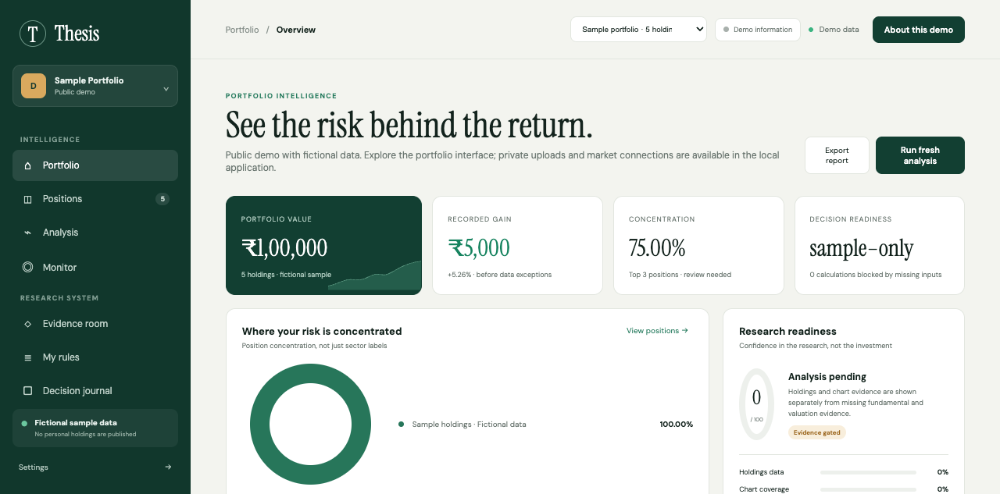

# Thesis Portfolio

An evidence-first portfolio research workspace with a public demo and local tools for structured company analysis.

**[Open the live demo →](https://thesis-portfolio-rouge.vercel.app)** · [Setup and deployment](docs/SETUP.md) · [Research workflow](docs/terminal-workflow.md) · [Report an issue](https://github.com/AviralKhanna/thesis-portfolio/issues)



## Explore the demo

No sign-in or installation is needed. The public website lets you:

- Explore five fictional companies and sample portfolio totals.
- Inspect concentration, return contribution, and research readiness.
- Open the positions view and filter or search its table.
- Export the sample portfolio as JSON.

The public demo does not accept uploaded files, brokerage credentials, or live market connections. Several research sections are placeholders. **Run fresh analysis** explains the local workflow; it does not perform research on the public site.

## Public demo versus local tools

| Capability | Public website | Local research tools |
| --- | --- | --- |
| Portfolio interface | Fictional sample | Same demo frontend |
| Search, filtering, sample export | Available | Available |
| Company evidence validation | Unavailable | Terminal commands |
| Deterministic reports and snapshots | Unavailable | Terminal commands |
| Market integrations and file APIs | Unavailable | Backend modules; additional private setup required |

Compatibility and evidence coverage are research measures, not investment recommendations. The sample data does not describe an actual investor's holdings.

## Run the demo locally

Requires Python 3:

```sh
git clone https://github.com/AviralKhanna/thesis-portfolio.git
cd thesis-portfolio
python3 -m http.server 4010 --bind 127.0.0.1 --directory frontend
```

Open **http://localhost:4010**. No npm install is needed for the static demo.

## Use the research tools

Requires Node.js 20.11 or newer; Node.js 22+ is recommended. The tools use Node's built-in modules.

```sh
npm run check
npm run thesis -- new DEMO
npm run thesis -- validate DEMO
npm run thesis -- report DEMO
```

Fill the generated evidence templates before interpreting a report. Validation of a new, empty template will report missing information. See the [terminal workflow](docs/terminal-workflow.md) for input fields and evidence requirements.

## Project structure

```text
frontend/        Public, fictional-data demo
backend/         Local portfolio and market integration APIs
src/lib/         Research, scoring, evidence, and memory logic
src/data/        Research rules and reference knowledge
scripts/         Terminal research and batch commands
input/           Company evidence examples
reports/         Generated research examples and snapshots
templates/       Starting templates for new research
tests/          Node test suite
```

## Validation and deployment

`npm run check` runs syntax checks and the research tests. All 35 tests passed during the publication check.

Vercel serves only `frontend/`. Personal storage, input documents, reports, and credentials are excluded from the website deployment. The repository includes an ITC research example and company reports; these are research material, not a personal portfolio.

## Author

Built by [Aviral Khanna](https://github.com/AviralKhanna).
